# 理论

## 栈（Stack）

**定义**

- 栈是一种先进后出（last in first out，LIFO）的线性数据结构

**操作**

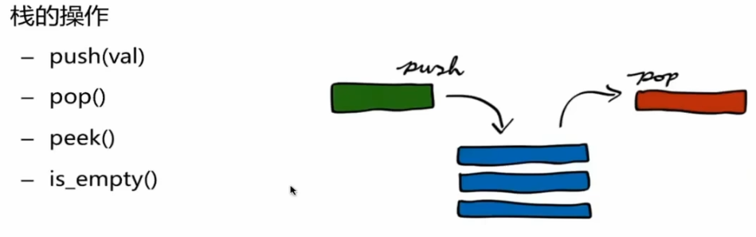

**实现**

- 使用List实现
  - List的尾部相当于stack的栈顶


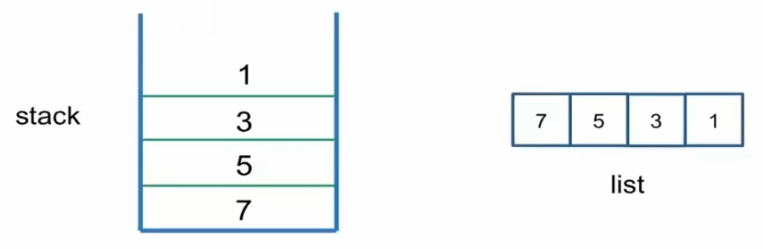

- 使用Deque实现

**调用栈（Call Stack)**

- 操作系统用来保存函数的状态
- 栈溢出：StackOverFlow

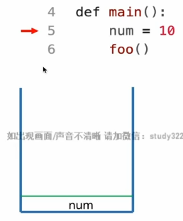

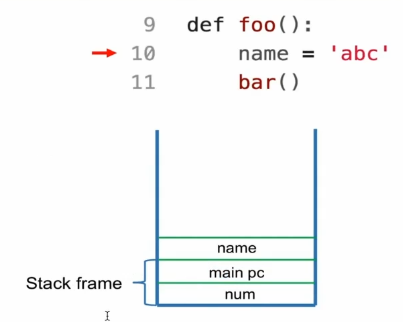

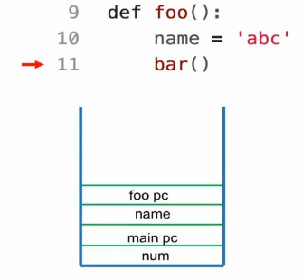

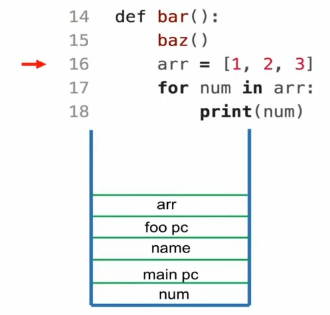

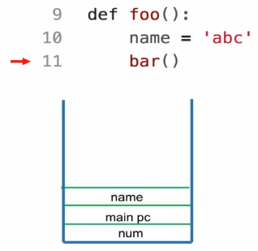

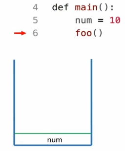

## 队列（Queue）

**定义**

- 先进先出

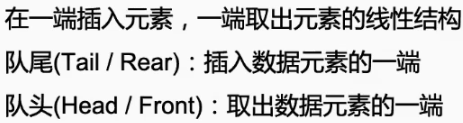

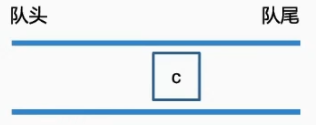

**操作**

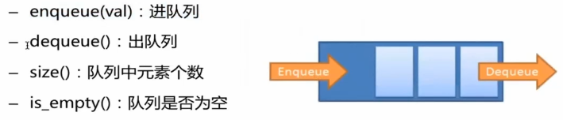

**实现**

- 使用LinkedList实现

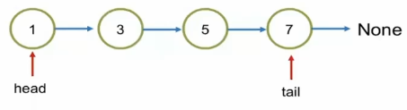

- 使用Deque实现

**应用**

- 消息队列（Message Queue）
- 宽度优先搜索（Breadth-First-Search）

# 题目

### Valid Parentheses (lintcode 423)

```python3
class Solution:
    """
    @param: s:str
    @return: bool
    """
    def is_valid_parentheses(self, s):
        stack = []
        
        for char in s:
            if char == '(':
                stack.append(')')
            elif char == '{':
                stack.append('}')
            elif char == '[':
                stack.append(']')
            else:
                if not stack:
                    return False
                if char != stack.pop():
                    return False
        
        return not stack
```

- Time: O(N)
  - N：字符串长度
- Space: O(N)

### Simplify Path (lintcode 421)

```python3
class Solution:
    """
    @param: path:str
    @return: str
    """
    def simplify_path(self, path):
        nameList = path.split('/')
        stack = []
        
        for name in nameList:
            if name == '..':
                if stack:
                    stack.pop()
            elif name == '' or name == '.':
                continue
            else:
                stack.append(name)
            
        if not stack:
            return '/'
                
        result = ''
        while stack:
            result = '/' + stack.pop() + result
            
        return result
```

- Time: O(N)
  - N：字符串长度
- Space: O(N)

### Decode String (lintcode 575)

```python3
class Solution:
    """
    @param: s:str
    @return: str
    """
    def expression_expand(self, s):
        stack = []
        for char in s:
            if char != ']':
                stack.append(char)
                continue
            
            letters = []
            while stack and stack[-1] != '[':
                letters.append(stack.pop())
            stack.pop()
            
            num = 0
            base = 1
            while stack and stack[-1].isdigit():
                num += int(stack.pop()) * base
                base *= 10
            
            string = ''.join(reversed(letters))
            stack.append(string * num)
                
        return ''.join(stack)
```

- Time: O(N)
  - N：字符串长度
- Space: O(N)

### Implement Queue by Two Stacks (lintcode 40)

```python3
class MyQueue:
    def __init__(self):
        self.inStack = []
        self.outStack = []
        
    
    """
    @param: element:int
    """
    def push(self, element):
        self.inStack.append(element)
        
    
    """
    @return: int
    """
    def pop(self):
        if not self.outStack:
            while self.inStack:
                self.outStack.append(self.inStack.pop())
                
        return self.outStack.pop()
    
    
    """
    @return: int
    """
    def top(self):
        val = self.pop()
        self.outStack.append(val)
        return val
```

- Time: O(1)
  - N：数据长度
- Space: O(N)

### Basic Calculator (lintcode 978)

```python3
class Solution:
    """
    @param: s:str
    @return: int
    """
    def calculate(self, s):
        number = 0
        sign = 1
        stack = []
        result = 0
        
        for c in s:
            if c in '0123456789':
                number = number * 10 + int(c)
            elif c == '+':
                result += sign * number
                number = 0
                sign = 1
            elif c == '-':
                result += sign * number
                number = 0
                sign = -1
            elif c == '(':
                stack.append(result)
                stack.append(sign)
                result = 0
                number = 0
                sign = 1
            elif c == ')':
                result += sign * number
                number = 0
                result *= stack.pop()
                result += stack.pop()
                
        result += sign * number
        return result
```

- Time: O(N)
  - N：字符串长度
- Space: O(N)

### Implement Queue by Linked List (lintcode 492)

```python3
class MyQueue:
    def __init__(self):
        self.size = 0
        self.dummy = ListNode(float('inf'))
        self.tail = self.dummy
        
    
    """
    @param: item:int
    """
    def enqueue(self, item):
        newNode = ListNode(item)
        self.tail.next = newNode
        self.tail = self.tail.next
        self.size += 1
        
    
    """
    @return: int
    """
    def dequeue(self):
        if self.isEmpty():
            return -1
        
        if self.dummy.next == self.tail:
            self.tail = self.dummy
        
        val = self.dummy.next.val
        self.dummy.next = self.dummy.next.next
        self.size -= 1
        return val
    
    
    """
    @return bool
    """
    def isEmpty(self):
        return self.size == 0
    
    
    """
    @return: int
    """
    def size(self):
        return self.size
```

- Time: O(1)
- Space: O(1)

### Zigzag Iterator II (lintcode 541)

```python3
# 双指针
class ZigzagIterator2:
    """
    @param: vecs:List[List[int]]
    """
    def __init__(self, vecs):
        self.vecs = vecs
        self.row = 0
        self.col = 0
        self.nonEmptyRowCount = len(vecs)
        for row in vecs:
            if len(row) == 0:
                self.nonEmptyRowCount -= 1
        
        
    """
    @return: int
    """
    def _next(self):
        while self.col > len(self.vecs[self.row]) - 1:
            self.row += 1
            if self.row > len(self.vecs) - 1:
                self.row = 0
                self.col += 1
                
        if self.col == len(self.vecs[self.row]) - 1:
            self.nonEmptyRowCount -= 1
        
        val = self.vecs[self.row][self.col]
        
        self.row += 1
        if self.row > len(self.vecs) - 1:
            self.row = 0
            self.col += 1
        
        return val
        
        
    """
    @return: bool
    """
    def hasNext(self):
        return self.nonEmptyRowCount != 0
```

- Time: O(1)
- Space: O(1)

```python3
# 队列
class ZigzagIterator2:
    """
    @param: vecs:List[List[int]]
    """
    def __init__(self, vecs):
        self.queue = collections.deque()
        for vec in vecs:
            if vec:
                self.queue.append([iter(vec), len(vec)])
                
                
    """
    @return: int
    """
    def _next(self):
        vecIter, vecLen = self.queue.popleft()
        val = next(vecIter)
        vecLen -= 1
        if vecLen > 0:
            self.queue.append([vecIter, vecLen])
        return val
    
    
    """
    @return: bool
    """
    def hasNext(self):
        return len(self.queue) != 0
```

- Time: O(1)
- Space: O(1)

### Implement Queue by Interface (lintcode 546)

```python3
class InterfaceQueue:
    def push(self, element):
        pass

    # define an interface for pop method
    # write your code here
    def pop(self):
        pass

    # define an interface for top method
    # write your code here
    def top(self):
        pass
        

class MyQueue(InterfaceQueue):
    def __init__(self):
        self.queue = collections.deque()
        
    
    """
    @param: val:int
    """
    def push(self, val):
        self.queue.append(val)
        
        
    def pop(self):
        return self.queue.popleft()
        
    
    """
    @return: int
    """
    def top(self):
        return self.queue[0]
```

- Time: O(1)
- Space: O(1)

### Implement Stack (lintcode 495)

```python3
class Stack:
    def __init__(self):
        self.stack = []
        
        
    """
    @param: x:int
    """
    def push(self, x):
        self.stack.append(x)
        

    def pop(self):
        self.stack.pop()
        
        
    """
    @return: int
    """
    def top(self):
        return self.stack[-1]
    
    
    """
    @return: bool
    """
    def isEmpty(self):
        return len(self.stack) == 0
```

- Time: O(1)
- Space: O(1)

### Implement Stack by Two Queues (lintcode 494)

```python3
class Stack:
    def __init__(self):
        self.queue1 = collections.deque()
        self.queue2 = collections.deque()
        
        
    """
    @param: x:int
    @Time: O(1)
    """
    def push(self, x):
        self.queue1.append(x)
    
    
    """
    @Time: O(N)
    """
    def pop(self):
        while len(self.queue1) > 1:
            self.queue2.append(self.queue1.popleft())
        self.queue1.popleft()
        self.queue1, self.queue2 = self.queue2, self.queue1
        
        
    """
    @return: int
    @Time: O(N)
    """
    def top(self):
        while len(self.queue1) > 1:
            self.queue2.append(self.queue1.popleft())
        val = self.queue1.popleft()
        self.queue2.append(val)
        self.queue1, self.queue2 = self.queue2, self.queue1
        return val
    
    
    """
    @return: bool
    @Time: O(1)
    """
    def isEmpty(self):
        return len(self.queue1) == 0
```

### Implement Queue by Linked List II (lintcode 493)

```python3
class ListNode:
    def __init__(self, val=0, prev=None, next=None):
        self.val = val
        self.prev = prev
        self.next = next


class Dequeue:
    def __init__(self):
        self.head = None
        self.tail = None
        
        
    """
    @param: item:int
    """
    def push_front(self, item):
        if not self.head:
            node = ListNode(item)
            self.head = node
            self.tail = node
            return
        
        node = ListNode(item)
        node.next = self.head
        self.head.prev = node
        self.head = node
        
        
    """
    @param: item:int
    """
    def push_back(self, item):
        if not self.tail:
            node = ListNode(item)
            self.head = node
            self.tail = node
            return
        
        node = ListNode(item)
        node.prev = self.tail
        self.tail.next = node
        self.tail = node
        
        
    """
    @return: int
    """
    def pop_front(self):
        if not self.head:
            return
        
        if self.head == self.tail:
            val = self.head.val
            self.head = None
            self.tail = None
            return val
        
        temp = self.head
        val = temp.val
        self.head = self.head.next
        temp.next = None
        self.head.prev = None
        
        return val
    
    
    """
    @return: int
    """
    def pop_back(self):
        if not self.tail:
            return
        
        if self.tail == self.head:
            val = self.tail.val
            self.tail = None
            self.head = None
            return val
        
        temp = self.tail
        val = temp.val
        self.tail = self.tail.prev
        temp.prev = None
        self.tail.next = None
        
        return val
```

- Time: O(1)
- Space: O(1)

### Basic Calculator II (lintcode 980)

```python3
class Solution:
    """
    @param: s:str
    @return: int
    """
    def calculate(self, s):
        s= s.strip()
        
        preSign = '+'
        num = 0
        stack = []
        
        for i in range(len(s)):
            if s[i].isdigit():
                num = num * 10 + int(s[i])
                
            if i == len(s) - 1 or s[i] in '+-*/':
                if preSign == '+':
                    stack.append(num)
                if preSign == '-':
                    stack.append(-num)
                if preSign == '*':
                    stack.append(stack.pop() * num)
                if preSign == '/':
                    stack.append(int(stack.pop() / num))
                preSign = s[i]
                num = 0
                
        return sum(stack)
```

- Time: O(N)
  - N：字符串长度
- Space: O(N)

### Min Stack (lintcode 12)

```python3
class MinStack:
    def __init__(self):
        self.stack = []
        self.minStack = []
        
    
    """
    @param: num:int
    """
    def push(self, num):
        self.stack.append(num)
        if not self.minStack:
            self.minStack.append(num)
        else:
            self.minStack.append(min(num, self.minStack[-1]))
            
            
    """
    @return: int
    """
    def pop(self):
        if not self.stack:
            return
        
        self.minStack.pop()
        
        return self.stack.pop()
    
    
    """
    @return: int
    """
    def min(self):
        if not self.minStack:
            return
        
        return self.minStack[-1]
```

- Time: O(1)
- Space: O(N)
