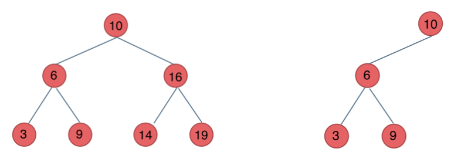

# 理论

## 树（Tree）

**定义**

- 树是一种用来表示**层次**关系的**非线性**数据结构
- 随处可见
  - 文件系统
  - 数据库的索引
  - 字典树
- 由节点（node）构成
- 每个节点有0或N个子节点（child node）， 没有子节点的是叶子结点（leaf node）
- 每个非根节点只有1个父节点（parent node），没有父节点的是根节点（root node）


## 二叉树（Binary Tree）

**定义**

- 每个节点最多有两个子节点
- 两个子节点分别为左孩子（left child）和右孩子（right child）
- 叶子结点：没有孩子的节点

```python3
class TreeNode:
    def __init__(self, val=0, left=None, right=None):
        self.val = val
        self.left = left
        self.right = right
```

**构建**

- 先建立单个节点
- 再将节点连接起来

**遍历**

- 深度优先遍历（Depth-First Search）
  - 先序遍历（preorder）
  - 中序遍历（inorder）
  - 后序遍历（postorder）
- 宽度优先遍历（Breadth-First Search）
  - 层序遍历（levelorder）
    - 在遍历中找到**目标点**
    - 在遍历中找到**到达目标点的路径**
    - 在遍历中找到**到达目标点的最小距离**


**类型**

- 满二叉树（Full Binary Tree）：如果一棵二叉树只有度为0的结点和度为2的结点，并且度为0的结点在同一层上，则这棵二叉树为满二叉树。

  

- 完全二叉树（Complete Binary Tree）：在完全二叉树中，除了最底层节点可能没填满外，其余每层节点数都达到最大值，并且最下面一层的节点都集中在该层最左边的若干位置。若最底层为第 h 层，则该层包含 1~ 2^(h-1)  个节点。

  

- 平衡二叉树（Balanced Binary Tree）：
  - 平衡二叉树可以是一颗空树
  - 左右子树的高度差不大于1
  - 子树也必须是一颗平衡二叉树


- 二叉搜索树（Binary Search Tree）
  - 若它的左子树不空，则左子树上所有结点的值均小于它的根结点的值
  - 若它的右子树不空，则右子树上所有结点的值均大于它的根结点的值
  - 它的左、右子树也分别为二叉排序树



- 二叉平衡搜索树（Balanced Binary Search Tree）
  - 又被称为AVL（Adelson-Velsky and Landis）树
  - 它是一棵空树或它的左右两个子树的高度差的绝对值不超过1
  - 左右两个子树都是一棵平衡二叉树


## 递归（Recursion）

**定义**

- 函数自己调用自己
- 树是一种递归的数据结构

- 递归是一种程序的写法

- 递归不是必须的，可以转化为迭代

**三要素**

- 递归的定义
- 递归的出口
- 递归的拆解

**复杂度**

- 时间复杂度
  - 函数调用的次数 * 每次函数调用的时间消耗
  - O(N)
- 空间复杂度
  - 堆（heap）空间 + 栈（stack）空间
  - O(logN)

# 题目

## 深度优先遍历

### Fibonacci Easy (lintcode 1807)

```python3
# DFS
class Solution:
    """
    @param: n:int
    @return: int
    """
    def fibonacci(self, n):
        if n == 1:
            return 0
        if n == 2:
            return 1
        return self.fibonacci(n - 2) + self.fibonacci(n - 1)
```

- Time: O(2^N)
- Space: O(1)

```python3
# DFS + Memorization
class Solution:
    """
    @param: n:int
    @return: int
    """
    def fibonacci(self, n):
        memo = [-1 for _ in range(n + 1)]
        memo[1] = 0
        memo[2] = 1
        return self.getFibonacci(n, memo)
    
    
    """
    @param: n:int, memo:List[int]
    @return: int
    """
    def getFibonacci(self, n, memo):
        if memo[n] != -1:
            return memo[n]
        
        memo[n] = self.getFibonacci(n - 1, memo) + self.getFibonacci(n - 2, memo)
        return memo[n]
```

- Time: O(N)
- Space: O(N)

### Binary Tree Preorder Traversal (lintcode 66)

```python3
class Solution:
    """
    @param: root:TreeNode
    @return: List[int]
    """
    def preorder_traversal(self, root):
        result = []
        self.preorder(root, result)
        return result
    
    
    """
    @param: root:TreeNode, result:List[int]
    """
    def preorder(self, root, result):
        if not root:
            return
        result.append(root.val)
        self.preorder(root.left, result)
        self.preorder(root.right, result)
```

- Time: O(N)
  - N：节点数量
- Space: O(H)
  - H：二叉树高度

### Binary Tree Inorder Traversal (lintcode 67)

```python3
class Solution:
    """
    @param: root:TreeNode
    @return: List[int]
    """
    def inorder_traversal(self, root):
        result = []
        self.inorder(root, result)
        return result
    
    
    """
    @param: root:TreeNode, result:List[int]
    """
    def inorder(self, root, result):
        if not root:
            return
        
        self.inorder(root.left, result)
        result.append(root.val)
        self.inorder(root.right, result)
```

- Time: O(N)
  - N：节点数量
- Space: O(H)
  - H：二叉树高度

### Binary Tree Postorder Traversal (lintcode 68)

```python3
class Solution:
    """
    @param: root:TreeNode
    @return: List[int]
    """
    def postorder_traversal(self, root):
        result = []
        self.postorder(root, result)
        return result
    
    
    """
    @param: root:TreeNode, result:List[int]
    """
    def postorder(self, root, result):
        if not root:
            return
        
        self.postorder(root.left, result)
        self.postorder(root.right, result)
        result.append(root.val)
```

- Time: O(N)
  - N：节点数量
- Space: O(H)
  - H：二叉树高度

### Binary Tree Leaf Sum (lintcode 481)

```python3
# 返回值为None
class Solution:
    """
    @param: root:TreeNode
    @return: int
    """
    def leaf_sum(self, root):
        self.result = 0
        self.preorder(root)
        return self.result
	
    
    """
    @param: root:TreeNode
    @return: int
    """
    def preorder(self, root):
        if not root:
            return
        
        if not root.left and not root.right:
            self.result += root.val
        
        self.preorder(root.left)
        self.preorder(root.right)
```

- Time: O(N)
  - N：节点数量
- Space: O(H)
  - H：二叉树高度

```python3
# 返回值为int
class Solution:
    """
    @param: root:TreeNode
    @return: int
    """
    def leaf_sum(self, root):
        if not root:
            return 0
        
        if not root.left and not root.right:
            return root.val
        
        left = self.leaf_sum(root.left)
        right = self.leaf_sum(root.right)
        
        return left + right
```

- Time: O(N)
  - N：节点数量
- Space: O(H)
  - H：二叉树高度

### Maximum Depth of Binary Tree (lintcode 97)

```python3
# 返回值为None
class Solution:
    """
    @param: root:TreeNode
    @return: int
    """
    def max_depth(self, root):
        self.result = 0
        self.preorder(root, 1)
        return self.result
    
    
    """
    @param: root:TreeNode, height:int
    """
    def preorder(self, root, height):
        if not root:
            return
        
        self.result = max(self.result, height)
        self.preorder(root.left, height + 1)
        self.preorder(root.right, height + 1)
```

- Time: O(N)
  - N：节点数量
- Space: O(H)
  - H：二叉树高度

```python3
# 返回值为int
class Solution:
    """
    @param: root:TreeNode
    @return: int
    """
    def max_depth(self, root):
        if not root:
            return 0
        
        left = self.max_depth(root.left)
        right = self.max_depth(root.right)
        
        return max(left, right) + 1
```

- Time: O(N)
  - N：节点数量
- Space: O(H)
  - H：二叉树高度

### Find Leaves of Binary Tree (lintcode 650)

```python3
class Solution:
    """
    @param: root:TreeNode
    @return: List[List[int]]
    """
    def findLeaves(self, root):
        self.results = []
        self.DFS(root)
        return self.results
    
    
    """
    @param: root:TreeNode
    @return: int
    """
    def DFS(self, root):
        if not root:
            return -1
        
        leftHeight = self.DFS(root.left)
        rightHeight = self.DFS(root.right)
        height = max(leftHeight, rightHeight) + 1
        
        if height >= len(self.results):
            self.results.append([])
        self.results[height].append(root.val)
        
        return height
```

- Time: O(N)
  - N：节点数量
- Space: O(H)
  - H：二叉树高度

### Binary Tree Path Sum (lintcode 376)

```python3
class Solution:
    """
    @params: root:TreeNode, target:int
    @return: List[List[int]]
    """
    def binary_tree_path_sum(self, root, target): 
        results = []
        self.DFS(root, target, [], results)
        
        return results
    
    
    """
    @params: root:TreeNode, target:int, path:List[int], results:List[List[int]]
    """
    def DFS(self, root, target, path, results):
        if not root:
            return
        
        if not root.left and not root.right:
            if target - root.val == 0:
                path.append(root.val)
                results.append(list(path))
                path.pop()
            return
        
        path.append(root.val)
        self.DFS(root.left, target - root.val, path, results)
        self.DFS(root.right, target - root.val, path, results)
        path.pop()
```

- Time: O(N)
  - N：节点数量
- Space: O(H)
  - H：二叉树高度

### Binary Tree Paths (lintcode 480)

```python3
class Solution:
    """
    @param: root:TreeNode
    @return: List:[str]
    """
    def binary_tree_paths(self, root):
        results = []
        self.DFS(root, [], results)
        return results
    
    
    """
    @param: root:TreeNode, path:List[str], results:List[str]
    """
    def DFS(self, root, path, results):
        if not root:
            return
        
        if not root.left and not root.right:
            path.append(str(root.val))
            results.append('->'.join(path))
            path.pop()
            return
        
        path.append(str(root.val))
        self.DFS(root.left, path, results)
        self.DFS(root.right, path, results)
        path.pop()
```

- Time: O(N)
  - N：节点数量
- Space: O(H)
  - H：二叉树高度

### Construct String from Binary Tree (lintcode 1137)

```python3
class Solution:
    """
    @param: root:TreeNode
    @return: str
    """
    def tree2str(self, root):
        result = []
        self.preorder(root, result)
        return ''.join(result)
    
    
    """
    @params: root:TreeNode, result:List[str]
    """
    def preorder(self, root, result):
        if not root:
            return
        
        result.append(str(root.val))
        
        if not root.left and not root.right:
            return
        
        if not root.left:
            result.append('()')
            result.append('(')
            self.preorder(root.right, result)
            result.append(')')
            return
        
        if not root.right:
            result.append('(')
            self.preorder(root.left, result)
            result.append(')')
            return
        
        result.append('(')
        self.preorder(root.left, result)
        result.append(')')
        
        result.append('(')
        self.preorder(root.right, result)
        result.append(')')
```

- Time: O(N)
  - N：节点数量
- Space: O(N)

### Tweaked Identical Binary Tree (lintcode 470)

```python3
class Solution:
    """
    @params: a:TreeNode, b:TreeNode
    @return: bool
    """
    def is_tweaked_identical(self, a, b):
        if not a and not b:
            return True
        
        if not a or not b:
            return False
        
        if a.val != b.val:
            return False
        
        left1 = self.is_tweaked_identical(a.left, b.left)
        right1 = self.is_tweaked_identical(a.right, b.right)
        
        left2 = self.is_tweaked_identical(a.left, b.right)
        right2 = self.is_tweaked_identical(a.right, b.left)
        
        return left1 and right1 or left2 and right2
```

- Time: O(N)
  - N：节点数量
- Space: O(H)
  - H：二叉树高度

### Minimum Depth of Binary Tree (lintcode 155)

```python3
class Solution:
    """
    @param: root:TreeNode
    @return: int
    """
    def min_depth(self, root):
        if not root:
            return 0
        
        self.result = float('inf')
        self.preorder(root, 1)
        return self.result
    
    
    """
    @param: root:TreeNode, depth:int
    """
    def preorder(self, root, depth):
        if not root:
            return
        
        if not root.left and not root.right:
            self.result = min(self.result, depth)
            return
        
        depth += 1
        self.preorder(root.left, depth)
        self.preorder(root.right, depth)
```

- Time: O(N)
  - N：节点数量
- Space: O(H)
  - H：二叉树高度

### Equal Tree Partition (lintcode 864)

```python3
class Solution:
    """
    @param: root:TreeNode
    @return: bool
    """
    def check_equal_tree(self, root):
        if not root:
            return False
            
        left = root.left
        root.left = None
        if self.getSum(root) == self.getSum(left):
            root.left = left
            return True
        root.left = left
        
        right = root.right
        root.right = None
        if self.getSum(root) == self.getSum(right):
            root.right = right
            return True
        root.right = right
        
        self.check_equal_tree(root.left)
        self.check_equal_tree(root.right)
        
        return False
    
    
    """
    @param: root:TreeNode
    @return: int
    """
    def getSum(self, root):
        if not root:
            return 0
        
        left = self.getSum(root.left)
        right = self.getSum(root.right)
        
        return left + right + root.val
```

- Time: O(N^2)
  - N：节点数量
- Space: O(H)
  - H：二叉树高度

```python3
class Solution:
    """
    @param: root:TreeNode
    @return: bool
    """
    def check_equal_tree(self, root):
        s = self.getSum(root)
        s, result = self.postorder(root, s)
        return result
    
    
    """
    @param: root:TreeNode
    @return: int
    """
    def getSum(self, root):
        if not root:
            return 0
        
        left = self.getSum(root.left)
        right = self.getSum(root.right)
        
        return left + right + root.val
    
    
    """
    @param: root:TreeNode, s:int
    @return: int, bool
    """
    def postorder(self, root, s):
        if not root:
            return 0, False
        
        if not root.left and not root.right:
            return root.val, False
        
        leftSum, leftFlag = self.postorder(root.left, s)
        rightSum, rightFlag = self.postorder(root.right, s)
        
        if leftSum * 2 == s or rightSum * 2 == s:
            return leftSum + rightSum + root.val, True
        
        return leftSum + rightSum + root.val, leftFlag or rightFlag
```

- Time: O(N)
  - N：节点数量
- Space: O(H)
  - H：二叉树高度

## 宽度优先遍历

### Binary Tree Level Order Traversal (lintcode 69)

```python3
class Solution:
    """
    @param: root:TreeNode
    @return: List[List[int]]
    """
    def level_order(self, root):
        if not root:
            return []
        
        queue = collections.deque([root])
        results = []
        
        while queue:
            level = []
            for _ in range(len(queue)):
                node = queue.popleft()
                level.append(node.val)
                if node.left:
                    queue.append(node.left)
                if node.right:
                    queue.append(node.right)
            results.append(level)
            
        return results
```

- Time: O(N)
  - N：节点数量
- Space: O(N)

### Binary Tree Level Order Traversal II (lintcode 70)

```python3
class Solution:
    """
    @param: root:TreeNode
    @return: List[List[int]]
    """
    def level_order_bottom(self, root):
        if not root:
            return []
        
        queue = collections.deque([root])
        results = []
        
        while queue:
            level = []
            for _ in range(len(queue)):
                node = queue.popleft()
                level.append(node.val)
                if node.left:
                    queue.append(node.left)
                if node.right:
                    queue.append(node.right)
            results.append(level)
            
        results.reverse()
        return results
```

- Time: O(N)
  - N：节点数量
- Space: O(N)

### Binary Tree Zigzag Level Order Traversal (lintcode 71)

```python3
class Solution:
    """
    @param: root:TreeNode
    @return: List[List[int]]
    """
    def zigzag_level_order(self, root):
        if not root:
            return []
        
        queue = collections.deque([root])
        results = []
        isLeftToRight = True
        
        while queue:
            level = []
            for _ in range(len(queue)):
                node = queue.popleft()
                level.append(node.val)
                if node.left:
                    queue.append(node.left)
                if node.right:
                    queue.append(node.right)
            if not isLeftToRight:
                level.reverse()
            results.append(level)
            isLeftToRight = not isLeftToRight
            
        return results
```

- Time: O(N)
  - N：节点数量
- Space: O(N)

### Convert Binary Tree to Linked Lists by Depth (lintcode 242)

```python3
class Solution:
    """
    
    """
    def binaryTreeToLists(self, root):
        if not root:
            return []
        
        queue = collections.deque([root])
        results = []
        
        while queue:
            dummy = ListNode(float('inf'))
            curr = dummy
            for _ in range(len(queue)):
                treeNode = queue.popleft()
                listNode = ListNode(treeNode.val)
                curr.next = listNode
                curr = curr.next
                if treeNode.left:
                    queue.append(treeNode.left)
                if treeNode.right:
                    queue.append(treeNode.right)
            results.append(dummy.next)
            
        return results
```

- Time: O(N)
  - N：节点数量
- Space: O(N)

### Binary Tree Level Sum (lintcode 482)

```python3
class Solution:
    """
    @params: root:TreeNode, level:int
    @return: int
    """
    def level_sum(self, root, level):
        if not root or level == 0:
            return 0
        
        queue = collections.deque([root])
        result = 0
        
        for _ in range(level - 1):
            for _ in range(len(queue)):
                node = queue.popleft()
                if node.left:
                    queue.append(node.left)
                if node.right:
                    queue.append(node.right)
                    
        for node in queue:
            result += node.val
            
        return result
```

- Time: O(N)
  - N：节点数量
- Space: O(N)

### Add One Row to Tree (lintcode 1122)

```python3
class Solution:
    """
    @params: root:TreeNode, val:int, depth:int
    @return: TreeNode
    """
    def add_one_row(self, root, val, depth):
        if depth == 1:
            head = TreeNode(val)
            head.left = root
            return head
        
        queue = collections.deque([root])
        
        for _ in range(depth - 2):
            for _ in range(len(queue)):
                node = queue.popleft()
                if node.left:
                    queue.append(node.left)
                if node.right:
                    queue.append(node.right)
                    
        for node in queue:
            newNode = TreeNode(val)
            newNode.left = node.left
            node.left = newNode
            
            newNode = TreeNode(val)
            newNode.right = node.right
            node.right = newNode
                
        return root
```

- Time: O(N)
  - N：节点数量
- Space: O(N)

