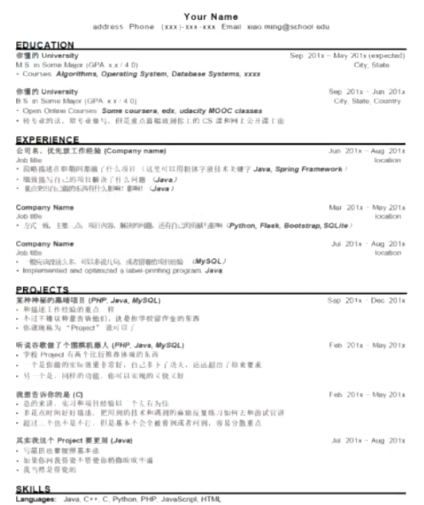

# 行业分析

## 如何快速拿到offer

-  心态不要崩，心态要稳
- 着迷于求职找工作（如痴如醉，不能自拔）
- 了解考察范围和题型套路
- 精刷题目300道，精读代码，归纳总结

- 每天专注2-4小时，长期坚持
-  准备与实战相结合
- 多跟小伙伴和过来人交流

## CS面试题型

- 简历筛选（工作经历 > 实习经历 > 课内外项目经历）（Web前后端项目 > 大数据项目/人工智能项目）
- 简历深挖
- 基础技术问题
- **算法面试（在线测试Online Assessment，Onsite）**
- 面向对象设计（Object Oriented Design）
- 系统设计（System Design）
- 行为面试（Behavioral Question）

## 算法面试九步法

- 理解问题，复述问题，澄清问题
- 初步想法，实例分析，书写代码
- 测试检验，评判性能，优化解法

## 薪水分布


## WLB排名


# 简历

- Education + Experience + Projects + Skills + Awards
- Education
  - 学校，专业，毕业时间
  - 上过的课（CS相关）
  - GPA（3.5以上可以写）

- Experience
  - 实习和工作经历
    - 公司，时间，职位
  - 实习和工作内容（重点）
    - 做了哪些项目，解决了哪些问题
  - 最重要的放在最醒目的位置
- Projects
  - 项目名称，时间，担任的角色
  - 具体做了什么，描述中要包括用到的技术
  - 结果如何，突出个人在项目中起到的作用
  - 按时间逆序写1-2个重要项目
  - 

- Skills
  - 主要用来充篇幅
  - Languages + Tools + Platforms
- Awards
  - 主要用来充篇幅
  - 奖学金，程序设计的奖项，竞赛排名，学校荣誉等等
- 注意事项
  - 内容控制在一页
  - 按时间顺序由近及远
  - 采用句式：
    - Completed/constructed/designed something using some **technologies** in order to implement/achieve some functionality/performance enhancement



# 面试

- Practice + Performance
- Practice
  - 每道题多思考一段时间
  - 看答案后要反思总结，关联记忆
  - 之后再次默写
- Performance
  - 面试考察一个人的整体水平
  - 要注意与面试官的交流，合作解决一个问题
  - 遇到原题要更加注意
  - 考虑面试官的体验

# Python 基础知识

## 变量

- 储存数据的容器
- 指令式编程中最重要的概念之一
  - 指令式编程（Imperative Programming）vs 函数式编程（Functional Programming）
- 直接看代码
  - 交互环境下运行代码 vs 将代码写到py文件中运行

- Python是动态类型语言，变量无类型，但里面的值有类型
  - 动态类型语言（Dynamically typed language）vs 静态类型语言（Statically typed language）

## 运算

### 整数运算

```python3
num = 10

# 数学运算
print(num + 5, num - 100, num * -3) # 加减乘
print(num / 3) # 3.33333
print(num // 3) # 向下取整 3
print(num // -3) # 向下取整 -4
print(int(num / -3)) # 四舍五入 -3
print(num % 3) # 取模运算 1

# 赋值运算
num += 5 # 等于 num = num + 5
num -= 5 # 等于 num = num - 5
num *= 5 # 等于 num = num * 5
num /= 5 # 等于 num = num / 5
num //= 5 # 等于 num = num // 5
num %= 5 # 等于 num = num % 5
```

### 浮点数运算

```python3
floatNum = -4.5

# 数学运算
print(floatNum + 2.4) # 2.1
print(floatNum - 1.5) # -6.0
print(floatNum * 2.9) # -13.04999999999999 浮点数精确度问题
print(floatNum / 8.7) # -0.5172413793103449

# 浮点数比较
print(abs(floatNum - 12.2) < 1e-5) # 比较与12.2的差值是否小于0.00001

# 赋值运算
floatNum += 5.5 # 等于 num = num + 5.5
floatNum -= 5.5 # 等于 num = num - 5.5
floatNum *= 5.5 # 等于 num = num * 5.5
floatNum /= 5.5 # 等于 num = num / 5.5
```

### 布尔运算

- 运算优先级：not > and > or

```python3
boolTrue = True
boolFalse = False

# 与 and
boolTrue and boolTrue # True
boolTrue and boolFalse # False
boolFalse and boolTrue # False
boolFalse and boolFalse # False

# 或 or
boolTrue or boolTrue # True
boolTrue or boolFalse # True
boolFalse or boolTrue # True
boolFalse or boolFalse # False

# 非 not
not boolTrue # False
not boolFalse # True
```

### 短路（Short Circuit）运算

```python3
num = 5
floatNum = 3.1
orTrue = num == 5 or floatNum > 4.5 # floatNum > 4.5 被短路，没有执行
andFalse = num > 8 and floatNum < 4.2 # floatNum < 4.2 被短路，没有执行
```

### Exchange Two Numbers

```python3
class Solution:
    """
    @params: num1:int, num2:int
    @return: int, int
    """
    def exchange(self, num1, num2):
        tmp = num1
        num1 = num2
        num2 = tmp
        return num1, num2
```

- Time: O(1)
- Space: O(1)

```python3
num1, num2 = num2, num1 # 元组交换
```

## 程序控制流（Control Flow）

### 顺序结构

- 从上到下顺序执行语句

### 控制结构

### Max of 3 Numbers (lintcode 283)

```python3
class Solution:
    """
    @params: num1:int, num2:int, num3:int
    @return: int
    """
    def max_of_three_numbers(self, num1, num2, num3):
        result = num1
        if num2 > result:
            result = num2
        if num3 > result:
            result = num3
        return result
```

- Time: O(N)
- Space: O(1)

### 循环结构

**for 循环**

```python3
nums = [1, 2, 3, 4, 5, 6]
for num in nums:
    print(num, end=' ') # 1 2 3 4 5 6

# range(start, end, step)
for i in range(len(nums)):
    print(num[i], end=' ') # 1 2 3 4 5 6

# 0 1, 1 2, 2 3, 3 4, 4 5, 5 6,
for i, num in enumerate(nums):
    print(i, num, end=', ')

# 执行4次退出for循环
for num in nums:
    if num == 4:
        break
        
# 4 5 6
for num in nums:
    if num < 4:
        continue
    print(num)
```

**while 循环**

```python3
nums = [1, 2, 3, 4, 5, 6]
i = 0
while i < len(nums):
    print(nums[i])
    i += 1
```

**多重循环**

```python3
nums = [[1, 2, 3], [4, 5, 6]]
for i in range(len(nums)):
    for j in range(len(nums[i])):
        print(nums[i][j])
```

## 函数（Function）

**函数定义**

- 定义：具有特定功能的代码段
- 增加代码复用（code reuse）
- 增强程序可读性（readability）

```python3
def find_number(nums, target):
    for num in nums:
        if num == target:
            return True
    return False
```

**函数调用**

```python3
def find_number(nums, target):
    for num in nums:
        if num == target:
            return True
    return False

if __name__ == "__main__":
    nums = [1, 2, 3, 4, 5, 6]
    target = 4
    print(find_number(nums, target))
```

**函数参数传递**

- 函数参数传递时会复制参数生成新的变量

```python3
def swap(num1, num2):
    num1, num2 = num2, num1

if __name__ == "__main__":
    num1, num2 = 1, 10
    swap(num1, num2)
    print(num1, num2) # num1和num2的值不会改变 
```

- 

## 面向对象入门（Object Oriented）

**对象（Object）的定义**

- 面向对象是一种世界观：世间万物皆为对象
- 面向对象是一种程序设计方式
- 对象（Object）：属性和行为

**类（class）的定义**

- 类是对象的蓝图
- 在Python中，类是对现实事物的抽象
- `class Student`: 类名，upper camel case
- `__init__` 是构造函数，当创建这个类的对象时自动调用，只能有1个构造函数
- `self` 指对象本身，在定义类的方法时必须有，但是调用时不需要
- `self.name = name`, `self.score = score`: 成员变量（member variable，field），表示对象的属性
- `speak(self)`: 成员函数（member function，method），表示对象的行为

```python3
class Student:
    def __init__(self, name='', score=0):
        self.name = name
        self.score = score
        
    def speak(self):
        print(self.name, self.score)
```

**创建对象**

- 实例（Instance）就是对象

```python3
class Student:
    def __init__(self, name, score):
        self.name = name
        self.score = score
        # self.student.speak()
        
    def speak(self):
        print(self.name, self.score)
        

if __name__ == "__main__":
    student = Student('Xiuyuan', 100)
    student.speak()
    student.score = 90
    student.speak()
```

**面向对象编程（OOP）**

- 用对象构建程序

**面向对象的三大特征**

- **封装（Encapsulation）**
  - 将属性和行为**封装**成一个类，并尽可能**隐蔽**类（对象）的内部细节，对外形成一个边界，只保留有限的**对外接口**使之与外部发生联系
  - 改变程序的组织方式
  - 增加代码的复用率
  - 提高程序开发效率
- **继承（Inheritance）**
- **多态（Polymorphism）**

**权限控制**

- `self.__score`：双下划线变量属于 private 变量，不能通过普通方式外部访问
- `student._Student__score`：可以通过名称修饰（name mangling）从外部访问

```python3
class Student:
    def __init__(self, name='', score=0):
        self.name = name
        self.__score = score
        self.student.speak()
        
    def speak(self):
        print(self.name, self.__score)
        
    def set_score(self, score):
        if score >= 0 and score <= 100:
        	self.__score = score
        
    def get_score(self):
        return self.__score
        

if __name__ == "__main__":
    student = Student('Xiuyuan', 100)
    print(student.name, student._Student__score)
    print(student.get_score())
    student.set_score(98)
```

# 基础题目

### Reverse 3-digit Integer (lintcode 37)

```python3
class Solution:
    """
    @param: number:int
    @return: int
    """
    def reverse_integer(self, number):
        onesDigit = number % 10
        tensDigit = number // 10 % 10
        hundredsDigit = number // 100 % 10
        
        return onesDigit * 100 + tensDigit * 10 + hundredsDigit
```

- Time: O(1)
- Space: O(1)

### A + B Problem (lintcode 1)

```python3
class Solution:
    """
    @params: a:int, b:int
    @return: int
    """
    def aplusb(self, a, b):
        return a + b
```

- Time: O(1)
- Space: O(1)

### Leap Year (lintcode 766)

```python3
class Solution:
    """
    @params: n:int
    @return: bool
    """
    def is_leap_year(self, n):
        if n % 4 == 0 and n % 100 != 0 or n % 400 == 0:
            return True
        return False
```

- Time: O(1)
- Space: O(1)

### Fizz Buzz (lintcode 9)

```python3
class Solution:
    """
    @params: n:int
    @return: List[str]
    """
    def fizz_buzz(self, n):
        result = []
        for i in range(1, n + 1):
            if i % 3 == 0 and i % 5 == 0:
                result.append('fizz buzz')
            elif i % 3 == 0:
                result.append('fizz')
            elif i % 5 == 0:
                result.append('buzz')
            else:
                result.append(str(i))
        return result
```

- Time: O(N)
- Space: O(1)

### Rectangle Area (lintcode 454)

```python3
class Rectangle:
    """
    @params: width:int, height:int
    """
    def __init__(self, width=0, height=0):
        self.width = width
        self.height = height
        
        
    """
    @return: int
    """
    def getArea(self):
        return self.width * self.height
```

- Time: O(1)
- Space: O(1)

### Swap Two Integers in Array (lintcode 484)

```python3
class Solution:
    """
    @params: a:List[int], index1:int, index2:int
    @return: None
    """
    def swap_integers(self, a, index1, index2):
        a[index1], a[index2] = a[index2], a[index1]
```

- Time: O(1)
- Space: O(1)

### Simple Calculator (lintcode 478)

```python3
class Calculator:
    """
    @params: a:int, op:str, b:int
    @return: int
    """
    def calculate(self, a, op, b):
        if op == '+':
            return a + b
        if op == '-':
            return a - b
        if op == '*':
            return a * b
        if op == '/':
            return a // b
```

- Time: O(1)
- Space: O(1)

### Setter and Getter (lintcode 222)

```python3
class School:
    def __init__(self):
        self.__name = None
        
        
    """
    @param: name:str
    """
    def setName(self, name):
        self.__name = name
        
        
    """
    @return: str
    """
    def getName(self):
        return self.__name
```

- Time: O(1)
- Space: O(1)

### Fibonacci (lintcode 366)

```python3
class Solution:
    """
    @param: n:int
    @return: int
    """
    def fibonacci(self, n):
        if n == 1:
            return 0
        if n == 2:
            return 1
        
        pre1, pre2 = 0, 1
        for _ in range(2, n):
            curr = pre1 + pre2
            pre1 = pre2
            pre2 = curr
            
        return curr
```

- Time: O(N)
- Space: O(1)

### ArrayList (lintcode 385)

```python3
class ArrayListManager:
    """
    @param: n:int
    @return: List[int]
    """
    def create(self, n):
        return [i for i in range(n)]
    
    
    """
    @param: l:List[int]
    @return: List[int]
    """
    def clone(self, l):
        return list(l)
    
    
    """
    @param: l:List[int], k:int
    @return: int
    """
    def get(self, l, k):
        return l[k]
    
    
    """
    @param: l:List[int], k:int, val:int
    @return: None
    """
    def set(self, l, k, val):
        l[k] = val
        
        
    """
    @param: l:List[int], k:int
    @return: None
    """
    def remove(self, l, k):
        # del l[k]
        l.pop(k)
        
        
    """
    @param: l:List[int], val:int
    @return: int
    """
    def indexOf(self, l, val):
        if val in l:
            return l.index(val)
        return -1
```

- Time: O(1)
- Space: O(1)

### Student ID (lintcode 455)

```python3
class Student:
    def __init__(self, id):
        self.id = id
        
    
class Class:
    def __init__(self, n):
        self.students = [Student(i) for i in range(n)]
```

- Time: O(N)
- Space: O(1)

### Student Level (lintcode 218)

```python3
class Student:
    """
    @param: name:str
    """
    def __init__(self, name):
        self.name = name
        self.score = 0
        
        
    """
    @return: str
    """
    def getLevel(self):
        if self.score >= 90:
            return 'A'
        if self.score >= 80:
            return 'B'
        if self.score >= 60:
            return 'C'
        return 'D'
```

- Time: O(1)
- Space: O(1)

### Root of Equation (lintcode 239)

```python3
class Solution:
    """
    @params: a:float, b:float, c:float
    @return: List[float]
    """
    def root_of_equation(self, a, b, c):
        result = []
        if b * b - 4 * a * c == 0:
            result.append(- b / (2 * a))
        elif b * b - 4 * a * c > 0:
            result.append((- b + math.sqrt(b ** 2 - 4 * a * c)) / (2 * a))
            result.append((- b - math.sqrt(b ** 2 - 4 * a * c)) / (2 * a))
            result.sort()
        return result
```

- Time: O(1)
- Space: O(1)

### Reverse Integer (lintcode 413)

```python3
class Solution:
    """
    @param: n:int
    @return: int
    """
    def reverse_integer(self, n):
        sign = 1
        if n < 0:
            sign = -1
            n = -n
            
        result = 0
        while n > 0:
            result = result * 10 + n % 10
            n //= 10
        
        result = result * sign
        
        if result < -(1 << 31) or result > (1 << 31) - 1:
            return 0
        
        return result
```

- Time: O(N)
  - N：数字位数
- Space: O(1)
