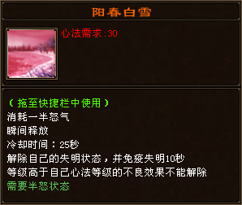
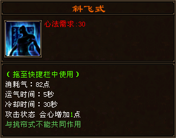
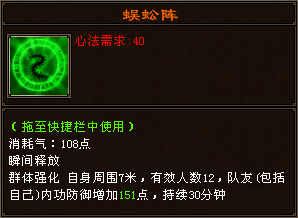
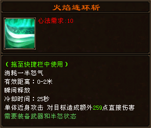
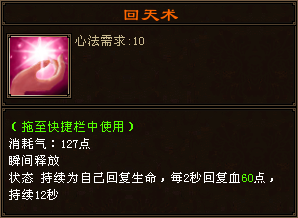
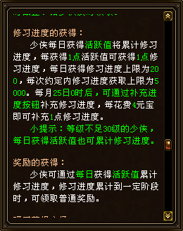
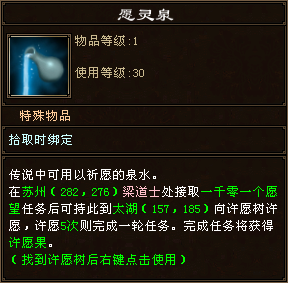
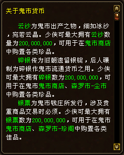
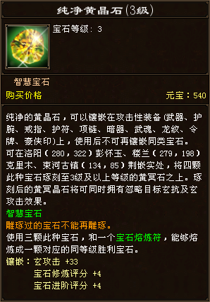
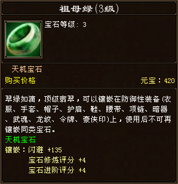

# 门派

## 天山

- 主冰属性

### 技能

**灵鹫功**

    
    
    

**小无相功**

**龟息功**

**天山融雪功**

**天山折梅手**

**天山六阳掌**

## 武当

- 主冰属性

### 技能

**阴阳诀**

**乱环诀**

**虚实诀**

**太极剑法**

**太极拳法**

**南华经**

## 星宿

- 主毒属性

### 技能

**腐尸功**

**五毒功**

**三笑逍遥散**

**神木功**

**圣水经**

**拼命三式**

## 明教

- 主火属性

### 技能

**七丧拳**

**葵花秘笈**

**天地挪移法**

**激流大法**

**烈焰大法**

**明尊圣火功**

## 逍遥

- 主火属性

### 技能

**百花经**

**遁甲天书**

**太平要术**

**短歌行**

**丹青引**

**惊涛掌法**

## 峨眉

- 主玄属性

### 技能

**神女拳法**

**神佑经**

**洗髓经**

**淑女剑法**

**君子剑法**

**黯然别离张**

# 限时活动

## 棋局

**时间**

- 11:30 - 14:30
- 20:30 - 22:00

**奖励**

## 贼兵入侵

**时间**

- 11:00 - 12:00
- 13:00 - 14:00
- 15:00 - 16:00
- 17:00 - 18:00
- 19:00 - 20:00
- 21:00 - 22:00

**奖励**

## 偷袭门派

**时间**

- 00:00 - 00:30
- 10:00 - 10:30
- 12:00 - 12:30
- 16:00 - 16:30
- 18:00 - 18:30
- 20:00 - 20:30
- 22:00 - 22:30

**奖励**

## 野猪暴走

**时间**

- 14:00 - 16:40
- 21:30 - 23:59

**奖励**

# 全天活动

## 签到福利

### 每月签到

### 超值回馈

### 修武之约

## 师门任务

**奖励**

## 酒杯尽江湖

**介绍**

**奖励**

## 幸运快活三

**奖励**

## 除匪首力破三关

**奖励**

## 一千零一个愿望

**奖励**

## 鬼市

**介绍**

# 每周领取

# 商店

## 红利

**工资卡**

**介绍**

**红利商店**

## 绑定元宝

# 宝石

## 种类

**命运宝石**

**希望宝石**

**智慧宝石**

**玄微宝石**

**幻冥宝石**

**生命宝石**

**魅力宝石**

**命运宝石**

**天机宝石**

**胜利宝石**

## 获取

**古兰玉**

# 珍兽

## 技能

**主动技能**

