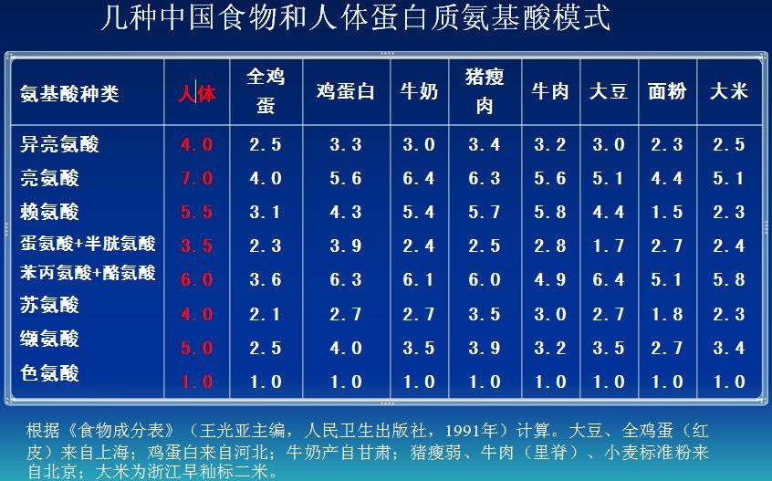

# 生命的基础：蛋白质

**蛋白质**：protein，一种能量营养素，生物大分子，由氨基酸（amino acid）分子组成

- 胰岛素：insulin，一种蛋白质

**生理功能**：

- 人体组织构成成分：body tissue component
  - 细胞膜及胞内结构
  - 人体瘦组织蛋白质含量丰富
  - 血红蛋白
  - 皮肤，骨骼，牙齿含胶原蛋白
  - 指甲含角蛋白
- 构成生理活性物质：constituting physological active substance
  - 酶
  - 激素
  - 抗体
  - 载体
  - 细胞膜通道
  - 体液可溶性蛋白质
- 提供能量：providing energy
  - 16.7kj（4.0kcal）/ g
  - 1kcal = 4.184kj

**蛋白质轻微缺乏**：

- 头发枯黄，断裂，指甲易裂，易断，生倒刺
- 肌肉松弛，缺乏弹性，皮肤粗糙，无光泽
- 低血压，贫血，手脚冰凉
- 抵抗力低，易感冒
- 肠胃功能差，消化不良
- 易疲劳，活动能力不足
- 严重缺乏可导致水肿
- 消瘦，儿童体型矮小

**蛋白质严重缺乏**：protein-energy malnutrition

- Kwashiorkor：
  - 蛋白质摄入不足，能量尚能维持，来源于碳水化合物
  - 体重下降不明显
  - 腹，腿水肿明显
  - 毛发干，脆，易脱落
- Marasmus：
  - 蛋白质，能量均绝对不足
  - 体重下降明显
  - 无明显水肿
  - 毛发稀疏，干枯，脱发

**蛋白质食物来源**：

- 豆类：36%-40%
- 鱼类：12%-25%
- 肉类：15%-20%
- 鸡蛋：11%-14%
- 谷类：7.45%-15%
- 牛奶：3%-3.5%
- 蔬菜：1%-2%

# 氨基酸

**氨基酸**：amino acids

- 必需氨基酸：essential amino acids
  - 异亮氨酸
  - 亮氨酸
  - 蛋氨酸
  - 苯丙氨酸
  - 赖氨酸
  - 苏氨酸
  - 色氨酸
  - 缬氨酸：xie 二声
  - 组氨酸：成人肝脏合成，婴儿无法合成

- 非必须氨基酸：nonessential amino acids
  - 丙氨酸
  - 精氨酸
  - 天冬氨酸
  - 天冬酰胺：xian an 一声
  - 谷氨酸
  - 谷氨酰胺
  - 甘氨酸
  - 脯氨酸：fu 三声
  - 丝氨酸

- 条件必须氨基酸：conditionally essential amino acids
  - 半胱氨酸：可由蛋氨酸转化而来
  - 酪氨酸：可由苯丙氨酸转化而来

**氨基酸模式**：amino acid pattern

- 蛋白质中各种必须氨基酸的结构比
- 以色氨酸含量为1，计算其他必须氨基酸的相应比值
- **食物蛋白质氨基酸模式与人体氨基酸模式越接近，就越容易被机体利用**
- 动物蛋白相比于植物蛋白利用率更高，鸡蛋白与人体蛋白质模式最接近

限制氨基酸：limiting amino acid

- 食物蛋白中一些含量相对较低的必须氨基酸
- **由于它们的存在，导致该食物蛋白质中其他必需氨基酸在体内不能被充分利用**
- 植物蛋白常见限制性氨基酸：赖，蛋，苏，色

蛋白质分类：

- 完全蛋白质：complete protein
  - 必须氨基酸种类齐全，数量充足
  - 氨基酸模式接近人体
  - 保证成人身体需要且能促进儿童生长发育
  - 如奶中酪蛋白
- 半完全蛋白质：partially complete protein
  - 必需氨基酸种类较齐全，但比例不合适
  - 如作膳食唯一蛋白来源，只能维持生命，不能很好地促进生长发育
  - 如麦胶蛋白
- 不完全蛋白质：incomplete protein
  - 必需氨基酸种类不全
  - 如作膳食唯一蛋白来源，既不能维持生命，也不能促进生长发育
  - 如胶原蛋白